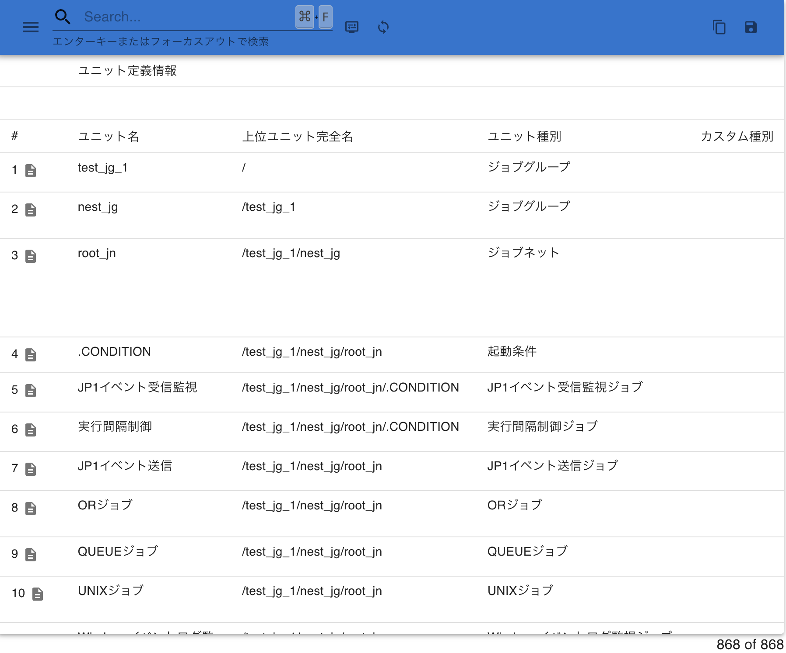
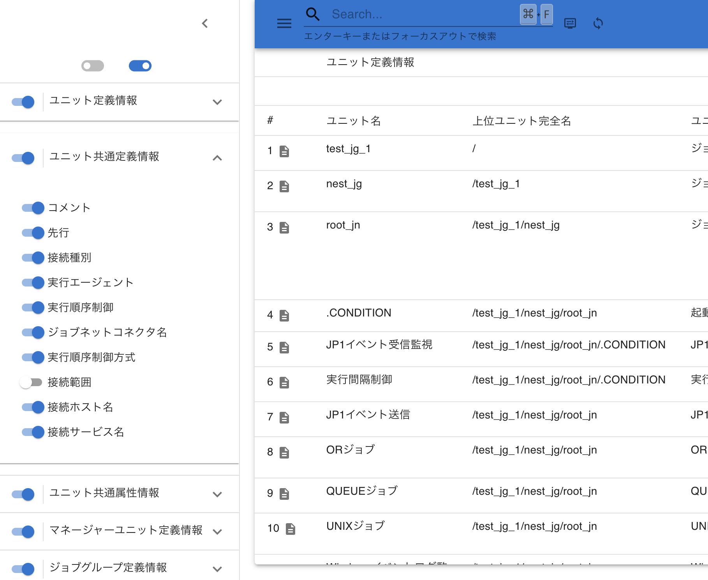
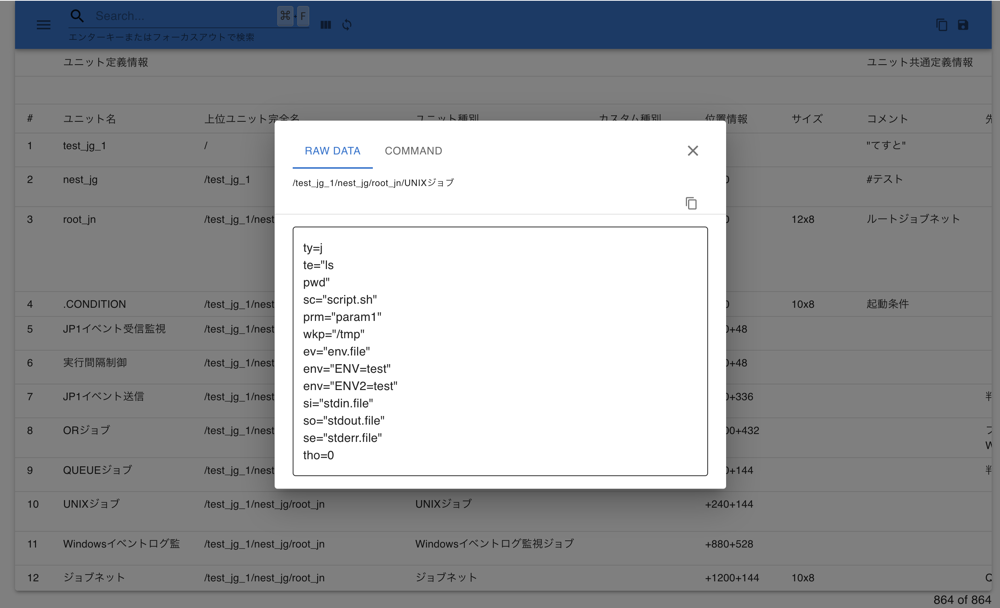
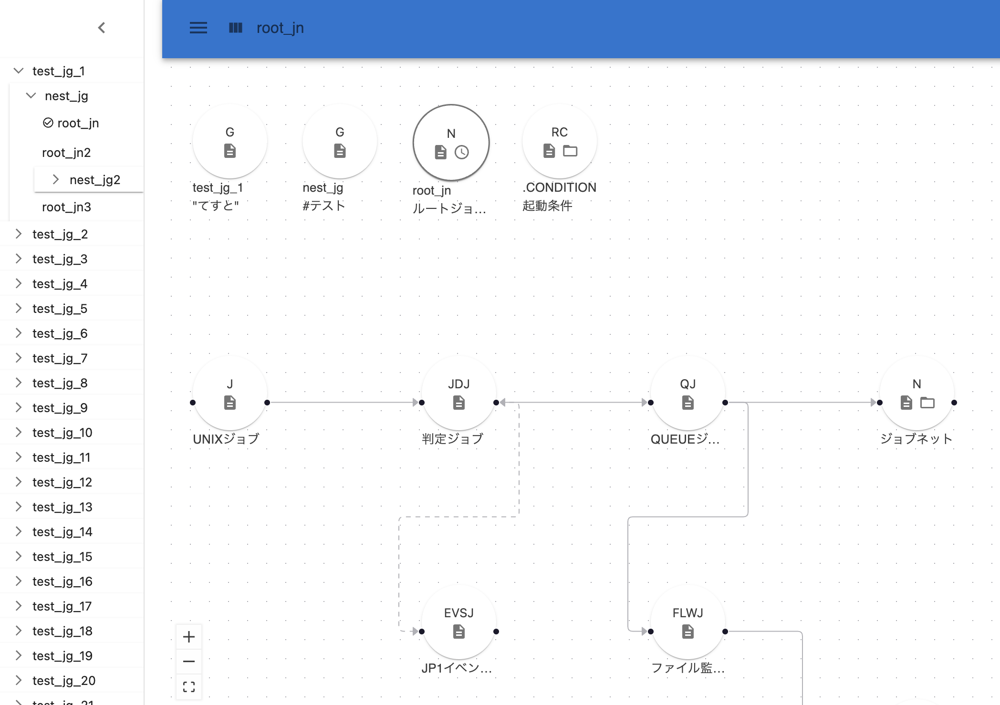

# vscode-ajsbutler

<!-- markdownlint-disable MD013 -->

[](LICENSE)
[![Visual Studio Marketplace Version][marketplace-version-badge]][marketplace]
[![Marketplace Downloads][marketplace-downloads-badge]][marketplace]
[![Visual Studio Marketplace Rating][marketplace-rating-badge]][marketplace]
[![Qlty Maintainability][qlty-badge]][qlty-project]

<!-- markdownlint-enable MD013 -->

The vscode-ajsbutler extension offers a convenient way to display definition
information for JP1/AJS3 from Hitachi in a human-readable format.

## Features

- Displays JP1/AJS3 definition information in an easily readable format.
- Set the editor’s language mode to ‘jp1ajs’ to view the formatted
  definition items.
- Switch the editor to enable a list-style display of the information.
  
- Select which items to display in the unit list.
  
- View unit definitions.
  
- Save data in CSV format.
- Switch the editor to enable a flow-style display of the information.
  
- Supports web extensions.

## Extension Settings

This extension does not require any specific configuration settings.

## Usage

To use this extension:

1. Install the extension.
2. Set the editor’s language mode to ‘jp1ajs’ to view the formatted
   definitions.
3. Switch the editor to enable either a list-style or flow-style display.

## Development

This repository is incrementally adopting Specification-Driven Development
(SDD) and cleaner application boundaries.

- SDD guidance starts in `docs/specs/README.md`.
- Repository-level use-case contracts live in
  `docs/requirements/use-cases/`.
- Branch-level planning is tracked in `docs/specs/plans.md`.
- `PLANS.md` is the root index that points to the active SDD documents.
- Codex-specific repository guidance lives in `AGENTS.md`.
- Docs-only work should use a `docs/...` branch name and stay within the
  docs-only file set used by `.github/workflows/verify.yml`:
  `docs/**`, `README.md`, `.codex/**/*.md`, and `.github/**/*.md`.

Recent refactoring work introduced:

- a normalized AJS model for application-facing use cases
- application use cases for unit list, flow graph, CSV export, and unit
  definition building
- a table row/view adapter so the table UI consumes application view data
  instead of `UnitEntity` wrapper accessors
- repeatable web-extension verification via `npm run test:web`

Browser-based extension testing uses `@vscode/test-web`, which currently
requires Node.js 20 or later.
If you manage Node with nodebrew, switch to a Node 20 release before running
browser tooling:

```bash
nodebrew install-binary v20.19.0
nodebrew use v20.19.0
hash -r
npm install
```

After switching, you can run:

```bash
npm run qlty
npm test
npm run test:web
npm run build
```

The `sample/` directory contains reusable JP1/AJS definition files for parser,
normalization, unit-list, and flow-graph regression tests. Prefer those shared
fixtures over ad hoc large inline definitions when adding broader coverage.

For manual browser-side verification during development, use the VS Code
launch configuration `Launch Extension(web)` in `.vscode/launch.json`.

`npm run test:web` runs the extension test suite against VS Code for the Web
in headless Chromium.
GitHub Actions also runs `npm run lint:md`, `npm run build`, `npm test`, and
`npm run test:web` on pushes and pull requests.

## For AI Agents

This repository supports both **Copilot CLI** and **Codex** (VS Code Copilot).
Agents should coordinate using a shared routing guide rather than separate
configurations.

### Quick Reference

| Agent                      | Best For                               | Configuration                     |
| -------------------------- | -------------------------------------- | --------------------------------- |
| **Codex** (VS Code chat)   | Live coding, refactoring, SDD workflow | `.codex/skills/`                  |
| **Copilot CLI** (terminal) | Automation, git ops, batch scripts     | `.github/copilot-instructions.md` |

### Routing Guide

For detailed task-to-agent assignment and shared principles:
- **See** `AGENTS.md` § "AI Agent Routing Guide"
- This is the **single source of truth** for both agents

### Key Files

- `AGENTS.md` - Architecture rules and agent routing (source of truth)
- `docs/specs/` - Specification-driven development documentation
- `.github/copilot-instructions.md` - Copilot CLI entry point
- `.codex/skills/` - Codex-specific workflows

## Telemetry

This extension collects telemetry data to improve the experience of using this
extension with VS Code. We only collect data on which commands are executed.
We do not collect any information about names, addresses, paths, etc. The
extension respects the telemetry.enableTelemetry setting. You can learn more
about that setting in our [FAQ][telemetry-faq].

## License

MIT

<!-- markdownlint-disable MD013 -->

[marketplace]: https://marketplace.visualstudio.com/items?itemName=kittybbit.vscode-ajsbutler
[marketplace-version-badge]: https://img.shields.io/visual-studio-marketplace/v/kittybbit.vscode-ajsbutler
[marketplace-downloads-badge]: https://img.shields.io/visual-studio-marketplace/d/kittybbit.vscode-ajsbutler
[marketplace-rating-badge]: https://img.shields.io/visual-studio-marketplace/stars/kittybbit.vscode-ajsbutler
[qlty-project]: https://qlty.sh/gh/kittybbit/projects/vscode-ajsbutler
[qlty-badge]: https://qlty.sh/badges/0cc9e169-14e8-44d7-a0de-5c358687a18e/maintainability.png
[telemetry-faq]: https://code.visualstudio.com/docs/supporting/faq#_how-to-disable-telemetry-reporting

<!-- markdownlint-enable MD013 -->
