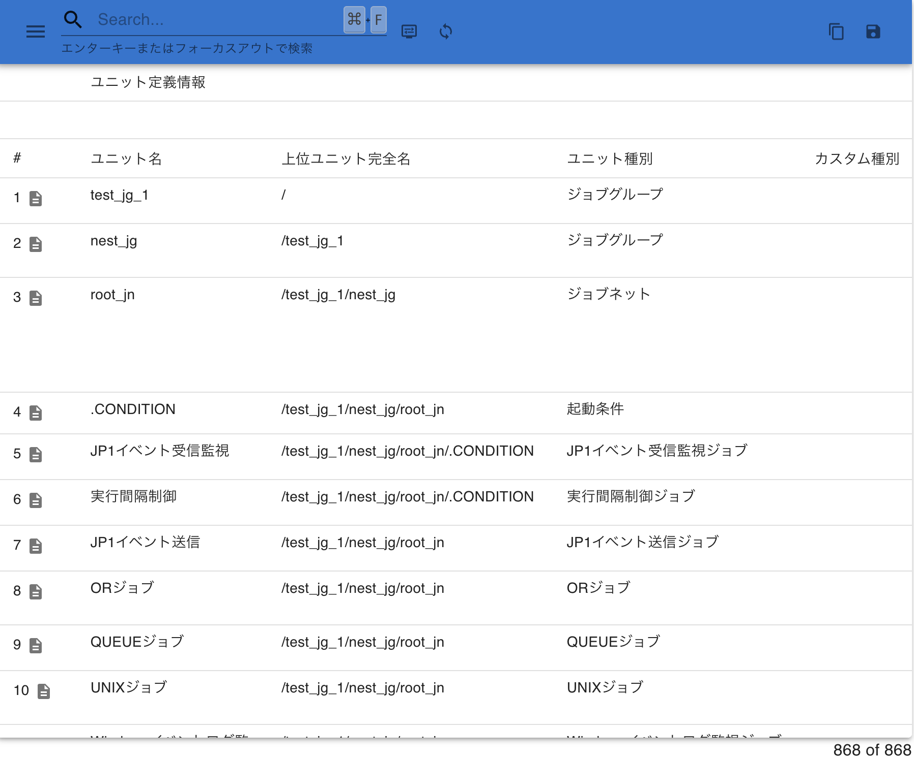
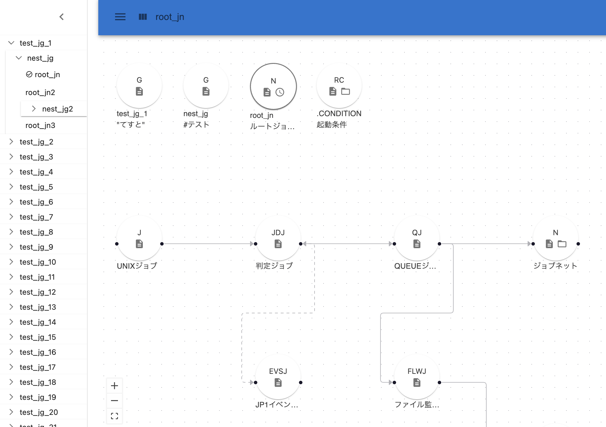

# JP1/AJS Butler

<!-- markdownlint-disable MD013 -->

JP1/AJS3 定義ファイル可視化ツール

JP1/AJS3の定義ファイルをVS Code上で解析し、ユニット一覧で検索したり、ジョブネットをフロー図で確認したりできる拡張機能です。定義を開いたまま、必要なジョブや構造を調べられます。

[English product page](README.en.md)

<!-- markdownlint-disable MD033 -->

  

  

<!-- markdownlint-enable MD033 -->

## こんな課題を解決します

- JP1/AJSの定義ファイルをテキストのまま読み続けるのが大変
- 大きなジョブネットの階層や依存関係を追いにくい
- 必要なジョブや定義項目を探すたびにファイル全体を見直している
- 障害調査や変更確認で、同じ定義を何度も追いかけている

## 主な機能

### ユニット一覧

JP1/AJS定義から、ジョブやジョブネットなどのユニットを一覧で確認できます。階層とユニットの情報を同じ画面で追えます。

### 検索と絞り込み

一覧やフローの検索で、必要なユニットを探せます。フローでは現在の範囲にある名前、コメント、パスを検索し、該当する位置へ移動できます。

### フロー図とネスト

ジョブネットの構造とユニット間の関係をフロー図で確認できます。ネストしたジョブネットは同じ画面で展開し、内部のフローへ入って確認できます。

### ユニット詳細

一覧やフローで選んだユニットの定義情報を確認できます。対応する範囲では、`ajsshow` や `ajsprint` のコマンド文字列も詳細に表示します。拡張機能がこれらのコマンドを実行したり、実行環境と連携したりする機能ではありません。

### CSV出力

表示中のユニット一覧をCSVとしてコピーできます。保存を選んだ場合は、VS Codeの保存先選択を経てファイルに書き出します。

### Semantic Diff

`JP1/AJS: Compare JP1/AJS Semantic Diff` で、現在の定義と選択した比較元の定義を意味単位で比較できます。比較結果はVS Code上のMarkdownレポートとして表示され、必要なときに `JP1/AJS: Copy Semantic Diff Markdown` で表示中のMarkdownを明示的にコピーできます。

### 診断とホバー

定義の診断結果をエディターで確認できます。対応するパラメーターにカーソルを合わせると、ホバーで補足情報を確認できます。

### WebAPI import beta

`JP1/AJS: Import JP1/AJS Definition via WebAPI (Beta)` で、利用者が指定したJP1/AJS WebAPIエンドポイントから定義情報を読み込めます。この機能はread-onlyのbeta版で、Desktop版のVS Codeでだけ利用できます。定義の変更や書き戻しは行いません。

## クイックスタート

1. [VS Code MarketplaceからJP1/AJS Butlerをインストール](https://marketplace.visualstudio.com/items?itemName=kittybbit.vscode-ajsbutler)します。
2. JP1/AJSの定義ファイルを、VS Codeのアクティブなエディターで開きます。
3. 必要に応じて、ステータスバーの言語モードを `JP1/AJS`（識別子 `jp1ajs`）に変更します。ファイルの自動認識を前提にしていません。
4. コマンドパレットから `View: Open JP1/AJS table viewer` を実行します。

一覧が表示されたら、検索欄でユニットを探し、行の詳細を開いてください。フローを最初から試す場合は、同じ手順の4で `View: Open JP1/AJS flow viewer` を選べます。

## 画面と操作

一覧画面では、ユニットの階層を確認しながら検索、列の表示、詳細の確認、CSV出力を行えます。フロー画面では、検索結果をたどり、関係するユニットを選び、ネストしたジョブネットを展開できます。

Semantic Diffは `JP1/AJS: Compare JP1/AJS Semantic Diff` から起動します。

## 対応範囲

- JP1/AJS3の定義を対象に、一覧、検索、フロー、詳細表示、診断などを提供します。
- 一覧とフローの表示は、Desktop版とWeb版のVS Codeで利用できます。共通の表示機能でも、ホストごとの制約があります。
- VS Code互換性は、`package.json` の `engines.vscode` にある `^1.75.0` を基準にします。
- リポジトリの代表例では、UTF-8とShift_JISの定義を扱う検証を行っています。すべての製品バージョンや定義形式を保証する対応表ではありません。
- WebAPI import betaはDesktop版だけで利用できます。Web版で同じ通信機能は使えません。

## セキュリティとプライバシー

この拡張機能は、利用者が開いたローカル定義を読み取って、一覧、フロー、診断、比較などの依頼された処理を行います。元の定義ファイルを自動で書き換えません。

テレメトリは、拡張機能の利用状況を改善するために、ホスト種別、機能領域、処理結果、診断カテゴリ、件数や時間の粗い区分などの匿名の運用情報を送信することがあります。定義内容、ファイルパス、ジョブ名やユニット名、サーバー名、検索文字列、資格情報、コマンド文字列はテレメトリに送信しません。テレメトリはVS Codeの `telemetry.enableTelemetry` 設定を尊重します。

テレメトリ通信はテレメトリ用のアダプターを通じて行われます。CSVは、利用者がコピーまたは保存を選んだときに出力します。ファイルに保存する場合だけ、保存先を指定します。ファイルへの保存は利用者の操作で行います。

WebAPI import betaを使う場合だけ、利用者が選択したJP1/AJS WebAPIエンドポイントへread-onlyの通信を行います。拡張機能の通常のローカル定義確認にWebAPI接続は必要ありません。

## 制約と既知の問題

- 不正な定義や解釈できない項目では、診断やエラーが表示されることがあります。すべての定義を完全に解釈できるとは限りません。
- `ajsprint` は詳細画面に表示するコマンド文字列の生成に使います。拡張機能からのコマンド実行は行いません。
- WebAPI import betaは、実際のJP1/AJS環境や接続条件によって利用できる範囲が変わります。現在はread-only、beta、Desktop-onlyです。

## Issueとフィードバック

不具合、対応してほしい定義、表示上の問題は、[GitHub Issues](https://github.com/kittybbit/vscode-ajsbutler/issues)へ報告してください。定義内容、ファイルパス、サーバー名、資格情報などの業務情報はIssueに貼り付けないでください。

## 開発への参加

開発環境、テスト、Web版の確認、ANTLR、SDD、AI Agent、デバッグ、リリース手順は [CONTRIBUTING.md](https://github.com/kittybbit/vscode-ajsbutler/blob/main/CONTRIBUTING.md) にまとめています。

## ライセンス

[MIT License](LICENSE)

本拡張機能は、JP1/AJSの公式製品ではないOSSです。

## English

[Read the English product page](README.en.md)

VS Code and JP1/AJS are trademarks of their respective owners.

<!-- markdownlint-enable MD013 -->
