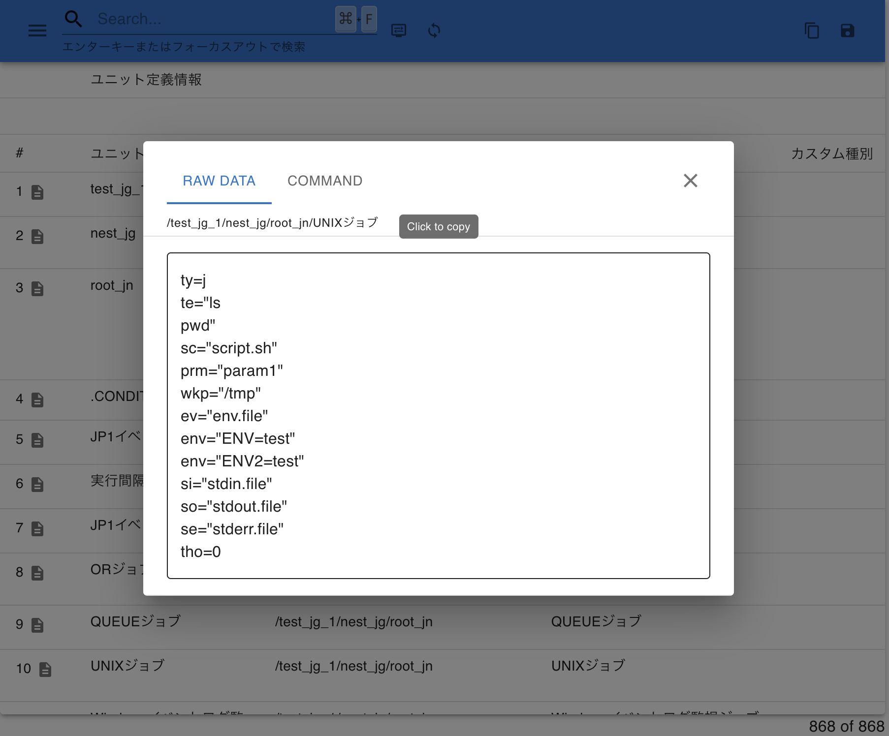

# vscode-ajsbutler

The vscode-ajsbutler extension offers a convenient way to display definition information for JP1/AJS3 from Hitachi in a human-readable format.

## Features

- Displays JP1/AJS3 definition information in an easily readable format.
- Set the editor’s language mode to ‘jp1ajs’ to view the formatted definition items.
- Switch the editor to enable a list-style display of the information.
  
- Select which items to display in the unit list.
  
- View unit definitions.
  
- Save data in CSV format.
- Switch the editor to enable a flow-style display of the information.
  
- Supports web extensions.

## Extension Settings

This extension does not require any specific configuration settings.

## Usage

To use this extension:

1. Install the extension.
2. Set the editor’s language mode to ‘jp1ajs’ to view the formatted definitions.
3. Switch the editor to enable either a list-style or flow-style display.

## Telemetry

This extension collects telemetry data to improve the experience of using this extension with VS Code. We only collect data on which commands are executed. We do not collect any information about names, addresses, paths, etc. The extension respects the telemetry.enableTelemetry setting which you can learn more about in our [FAQ](https://code.visualstudio.com/docs/supporting/faq#_how-to-disable-telemetry-reporting).

## License

MIT
