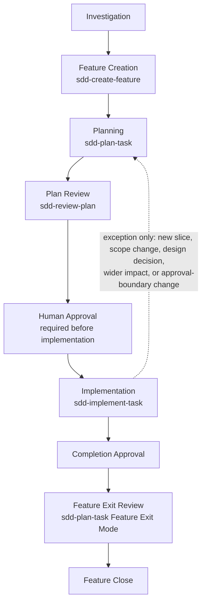

# SDD Overview

This directory is the entry point for Specification-Driven Development in this
repository.

## Goals

- keep behavior stable while refactoring incrementally
- make use cases explicit before structural changes
- preserve desktop and web extension compatibility
- support migration toward clearer domain, application, infrastructure, and
  presentation boundaries

## Recommended Reading Order

1. [Vision](./vision.md)
2. [Glossary](./glossary.md)
3. [Context Map](./context-map.md)
4. [Architecture](./architecture.md)
5. [Roadmap](./roadmap.md)
6. [Requirements Use Cases](../requirements/use-cases/README.md)

## Working Agreement

SDD is the standard process for non-trivial changes. Use the Codex SDD skills
as the operational workflow:



Human Approval is required before implementation starts. Replanning is an
exception flow, not the normal path between approved implementation slices.
Feature Exit runs only after the Feature Definition of Done is satisfied.

## Trivial Change Criteria

Use this section as the Single Source of Truth for deciding whether SDD feature
creation may be skipped.

A change is trivial only when it does not change any of these:

- runtime behavior
- tests or validation expectations
- generated artifacts
- configuration
- desktop, web, VS Code, JP1/AJS, or definition-file compatibility
- durable documentation responsibilities or document roles

Examples that may be trivial:

- typo fixes
- formatting-only markdown cleanup
- comment wording that does not change behavior, policy, or responsibility
- broken link fixes that do not change document meaning

When any item above changes, or when impact is uncertain, treat the work as
non-trivial and start with `sdd-create-feature`.

For non-trivial changes:

1. create a dedicated git branch before implementation work starts and use
   `docs/...` only for docs-only slices
2. start feature intake with `sdd-create-feature`
3. create or revise the full implementation-slice plan with `sdd-plan-task`
   in exactly one mode: Planning Mode, Replanning Mode, or Feature Exit Mode
4. review the plan with `sdd-review-plan`
5. obtain clear Human Approval before editing runtime code, tests, generated
   artifacts, or configuration
6. implement only approved slices with `sdd-implement-task`
7. return to `sdd-plan-task` only when a new slice, scope change, design
   decision, wider impact, approval-boundary change, or Feature Exit review is
   required
8. close a feature only after Feature Exit Mode confirms the Feature
   Definition of Done

Prefer quality assurance, readability, KISS, DRY/YAGNI, then SOLID in that
order. Do not add abstractions unless they reduce real complexity. Keep diffs
inside the approved slice scope.

For docs-only changes:

- `pnpm run build` is not required
- `rtk pnpm run qlty` is required
- run `rtk pnpm run lint:md` when the changed markdown scope benefits from
  markdown-specific validation
- repository `Verify` workflow should not be relied on as a required gate

Run validation commands through `rtk` by default. `rtk` is a cost-control and
execution-efficiency tool; it is not a reason to skip required validation.

## CHANGELOG Update Criteria

Use this section as the Single Source of Truth for deciding whether a
CHANGELOG update is required.

Update `CHANGELOG.md` when a change affects externally observable extension
behavior, including:

- user-visible behavior
- compatibility
- commands
- configuration
- diagnostics
- user workflow
- documented extension behavior

Do not update `CHANGELOG.md` for changes that are only:

- internal refactoring
- implementation cleanup
- tests with no externally observable behavior change
- documentation maintenance that does not change documented extension behavior
- other changes with no externally observable behavior

When uncertain, record the evaluation in the feature plan or implementation
summary and ask for the human decision before closing the slice or feature.

## Semantic Code Navigation

When Serena or another semantic code navigation tool is available, use it
during impact investigation and reference impact verification to identify
affected symbols, references, call sites, and dependency impact.

Use semantic analysis to reduce reference omissions, including transitive
reference and dependency impact, in:

- Phase 1 impact investigation before requesting approval
- Phase 3 reference impact verification after approval

Use Serena selectively. Default order:

1. targeted symbol lookup
2. direct reference lookup
3. call-site and dependency impact lookup
4. broader repository exploration only when uncertainty remains

Do not perform broad repository exploration before identifying target symbols.
Do not repeat the same semantic search without a new question.

Serena is supplemental tooling. It does not replace:

- SDD artifacts
- human approval
- approval evidence
- tests
- validation

Manual impact analysis remains required. Do not treat Serena-only results as
proof that a change is safe.

Start with local, targeted lookup to reduce token use. Use broad exploration
only when the targeted checks still leave uncertainty about impact or
references.

Minimal local setup:

```bash
uv tool install -p 3.13 serena-agent@latest --prerelease=allow
serena init
serena setup codex
```

If the MCP client cannot find `serena` on `PATH`, configure the Codex MCP
server command with the absolute path to the installed `serena` executable.

## Model and Agent Usage

Use model and agent selection to control cost and precision without changing
the SDD process. Do not define a separate abstract "intelligence" rule; choose
the model based on whether the current phase requires judgment or execution.

Recommended model use:

- planning, impact investigation, design decisions, and pre-approval review:
  use a high-accuracy model
- destructive-change decisions, architecture decisions, and specification
  decisions: use a high-accuracy model
- implementation inside an already-approved scope: medium- or lower-cost
  models may be used
- simple fixes, lint follow-up, and approved test expectation updates:
  lower-cost models may be used
- if implementation reveals an out-of-scope change, specification change, or
  design decision: stop and return to high-accuracy investigation and
  re-approval

Codex, GitHub Copilot, or another coding assistant may be used, but all agents
must follow the same SDD gate. Changing the agent or model does not change the
process.

Every agent must preserve:

- impact investigation
- approval evidence
- approved scope boundaries
- required validation

Keep feature documents decision-focused and follow the Document Roles section
below as the Single Source of Truth. Remove implementation history once it no
longer affects future approval, risk, traceability, or durable documentation.

Copilot suggestions must be checked against the approved `SPECS.md`,
`TASKS.md`, and approved scope before adoption. Do not accept Copilot
suggestions outside the approved scope. If an out-of-scope change appears
necessary, stop and return to investigation and re-approval.

When Codex orchestrates work across agents, Codex owns consistency of the SDD
documents, approval evidence, scope tracking, and validation record.

## Implementation Change Gate

Before editing runtime code, tests, generated artifacts, or configuration:

1. perform an impact investigation
2. record the findings in the right SDD artifacts
3. record the approval evidence section in the feature `TASKS.md`
4. report the planned change, affected files, affected functions/classes or
   components, affected features, affected tests, related docs,
   breaking-change risk, and alternatives
5. stop until a human gives clear approval for implementation

Clear approval means the human response unambiguously permits implementation
for the reported scope. The following are not approval:

- answers to investigation questions
- additional information
- design discussion
- ambiguous agreement
- Codex's own judgment

While approval is pending, Codex must not:

- edit runtime code
- edit tests
- edit generated artifacts
- edit configuration
- create an implementation branch
- create an implementation commit
- refactor for implementation purposes
- make incidental or "while here" fixes

While approval is pending, Codex may only:

- investigate
- update SDD documents
- record impact scope
- organize alternatives
- present the approval request

Each feature `TASKS.md` must include approval evidence for the approved plan
or active slice:

```md
## Human Approval

- Status: Pending | Approved
- Approved at:
- Approved scope:
```

`Approved at` records the approval result only, such as `none` or `approved in
current conversation`; do not copy the human approval message into `TASKS.md`.

Implementation may start only when `Status: Approved`, `Approved at`, and
`Approved scope` record the human-approved implementation boundary for the
slice. If implementation reveals required changes outside the approved scope,
stop, use `sdd-plan-task` Replanning Mode, update the impact record, and
obtain additional clear approval before editing those areas.

Before approval, Codex must report only this implementation-gate output and
must not claim that implementation has started or completed:

```md
## Impact Investigation Summary

- Planned change:
- Affected files:
- Affected functions/classes/components:
- Affected features:
- Affected tests:
- Related docs:
- Breaking-change risk:
- Alternatives:

## Approval Request

Please approve implementation before I edit runtime code, tests,
generated artifacts, or configuration.

Implementation will not proceed until approval is given.
```

After approval, `sdd-implement-task` implements exactly one approved slice.
Implementation should use staged validation: nearest fast check, related
tests, qlty, needed web tests, and build only when required for final
confidence.

Do not leave failing checks unexplained or deferred without an explicit
follow-up decision.

## Impact Investigation Records

Use the SDD artifacts by responsibility instead of storing all investigation
notes in feature documents. See Document Roles below for the authoritative
responsibility boundaries.

`TASKS.md` is not a historical work log. After a slice is completed,
re-scoped, or dropped, reduce the record to what still affects future
approval, risk, traceability, production readiness, or feature exit.

When behavior scenarios exist, include the scenario impact in the same
investigation: changed scenarios, added scenarios, removed scenarios, and
tests affected by those scenarios.

## Gherkin Usage

Use Gherkin selectively for behavior contracts where Given / When / Then makes
the expected behavior clearer.

Keep use-case sections separated by responsibility:

- `Rules`:
  invariant constraints, boundaries, must-not statements, compatibility
  requirements, and policy decisions that apply across scenarios
- `Behavioral Scenarios`:
  concrete observable examples of behavior, one behavior per scenario
- `Acceptance Notes`:
  supplemental acceptance or validation notes that are not already expressed by
  scenarios, such as fixture strategy, migration caveats, or cross-host checks
- `Risks Or Edge Cases`:
  unresolved hazards, rare inputs, and conditions that need focused future
  verification

When adding scenarios, remove or shorten `Acceptance Notes` that repeat the
same Given / When / Then behavior. Keep `Rules` unless they are only restating
one scenario and are not a general constraint.

Good fit:

- use-case scenarios
- regression-prone behavior
- domain rules
- bug recurrence prevention
- breaking-change examples

Poor fit:

- architecture design
- layering decisions
- refactor plans
- dependency design
- internal algorithm details

Prefer clarity over ceremony. Do not force every specification into Gherkin,
and do not add Cucumber or other executable-spec tooling unless a future slice
explicitly justifies it.

## Branch Naming

Use branch names to signal verification intent clearly:

- `docs/...`
  Reserve for docs-only slices.
- non-`docs/...`
  Use for any slice that changes runtime code, tests, config, or other
  non-doc files.

Match the branch name to the `Verify` workflow's docs-only rule.
In `.github/workflows/verify.yml`, a PR is treated as docs-only only when the
changed files stay within:

- `docs/**`
- `README.md`
- `.codex/**/*.md`
- `.github/**/*.md`

If a `docs/...` branch needs any file outside that set, rename the branch or
start a new non-doc branch before continuing.

## When To Use `docs/requirements/use-cases/`

Use `docs/requirements/use-cases/` for repository-level behavior contracts.
These files should remain meaningful even if modules, adapters, or file layout
change.

Good fit:

- application use cases such as build list, build flow graph, normalize
  document, export CSV, or show definition
- cross-feature behavior that multiple implementations or adapters rely on

Poor fit:

- branch task sequencing
- implementation notes tied to the current refactor
- file-by-file execution checklists

Those belong under `docs/specs/`.

## When To Remove Feature Docs

Remove a `docs/specs/features/<feature>/` folder only in Feature Exit Mode
after the Feature Definition of Done passes and the human approves closure.
Preserve information in durable docs only when it passes the Durable
Documentation Gate.

## Feature Definition Of Done

A feature is complete only when:

- every implementation slice is complete
- feature requirements and acceptance criteria are satisfied
- required validation is complete
- non-functional quality and production readiness are preserved or justified
- required `TRACEABILITY.md` updates are complete, or not required with a
  clear reason
- durable use-case, `plans.md`, and `roadmap.md` updates are complete when
  needed
- unresolved risks are resolved, accepted, or recorded as follow-up

## Feature Exit Review Output

Report Feature Exit Review using this standard output:

```md
## Feature Exit Review

- Feature:
- Completed slices:
- Acceptance status:
- Validation:
- Traceability:
- Production readiness:
- Durable documentation:
- Remaining risks:
- Closure recommendation: Close | Do not close | Human decision needed
```

Use `Closure recommendation: Close` only when the Feature Definition of Done is
satisfied. Use `Human decision needed` when the evidence is complete but the
closure decision still requires explicit approval.

## Durable Documentation Gate

Before updating long-lived docs, verify the content:

- is reusable beyond one feature
- describes durable behavior, specification, design policy, or repository
  operating policy
- helps future planning or implementation
- does not duplicate another durable document
- is not a temporary investigation result
- is not implementation history
- is not review commentary
- is not a record of a resolved issue

Update the smallest necessary durable document surface.

## Production Readiness Gate

For code slices, confirm:

- failure modes are intentional
- user-facing errors, diagnostics, or fallback behavior are understandable
- existing JP1/AJS definition files remain compatible unless explicitly
  changed by the approved scope
- large, malformed, or edge-case inputs avoid preventable slowdowns or crashes
- desktop and web behavior are considered
- README or user docs are updated only when user-facing behavior changes
- CHANGELOG update need is evaluated using the CHANGELOG Update Criteria

## Sync Cadence

Treat the following docs as required sync artifacts, not optional catch-up
notes:

- `docs/specs/features/<feature>/TASKS.md`
  Update when the implementation-slice plan, approval state, slice status,
  validation, risk, or feature exit readiness changes.
- `docs/specs/features/<feature>/TRACEABILITY.md`
  Update when required traceability changes or when an implemented slice's
  validation result must be reflected.
- `docs/specs/plans.md`
  Update only when the branch starts, stops, or changes an active feature.
- `docs/specs/roadmap.md`
  Update when that completion changes repository-level sequence, remaining
  debt, or deferred work.

Prefer the smallest useful cadence:
one completed slice or one resolved follow-up is enough reason to sync the
docs in the same commit.

When syncing, preserve decision context instead of accumulating entries:

- remove or rewrite completed checklist/history sections when they no longer
  help future maintainers understand the current state, remaining risk, next
  decision, or required use-case update
- keep `TASKS.md` readable from the top so the plan status, approval state,
  active slice, and next decision are immediately visible
- keep feature `SPECS.md` readable as functional requirements rather than as a
  task archive

## Document Roles

This section is the Single Source of Truth for SDD document responsibilities.
Other repository docs should link here instead of repeating these details.

- `vision.md`: product purpose and values.
- `glossary.md`: shared terms.
- `context-map.md`: boundaries and external systems.
- `architecture.md`: target layering and dependency direction.
- `features/_templates/`: templates for new repository-native feature docs.
- `docs/requirements/use-cases/`: durable behavior contracts and observable
  scenario changes that remain meaningful when modules, adapters, or file
  layout change.
- `docs/specs/features/<feature>/SPECS.md`: feature-level requirements,
  boundaries, compatibility constraints, acceptance criteria, and non-goals.
- `docs/specs/features/<feature>/TASKS.md`: the full implementation-slice
  plan, slice order, dependencies, approval state, validation expectations,
  production readiness, unresolved risks, and feature exit readiness.
- `docs/specs/features/<feature>/TRACEABILITY.md`: required mapping from use
  case or requirement through `SPECS.md`, implementation slice, and test or
  validation plan.
- `docs/specs/plans.md`: current branch work management. Keep active features,
  current priorities, unfinished work, and the next intended action here.
  Do not keep completed slice history, implementation logs, work diaries,
  resolved issues, or information used only after feature closure here.
- `docs/specs/roadmap.md`: repository-wide medium- and long-term planning.
  Keep future features, repository direction, and planned improvements here.
  Do not keep current branch work, feature progress, slice history, or
  implementation status here.
- `README.md`: repository entry point, user/developer overview, setup, basic
  commands, and links to detailed docs.
- `AGENTS.md`: agent-facing repository rules, architecture constraints, and
  routing entry point.

`docs/specs/plans.md` and `docs/specs/roadmap.md` are not places to store
implementation history.
